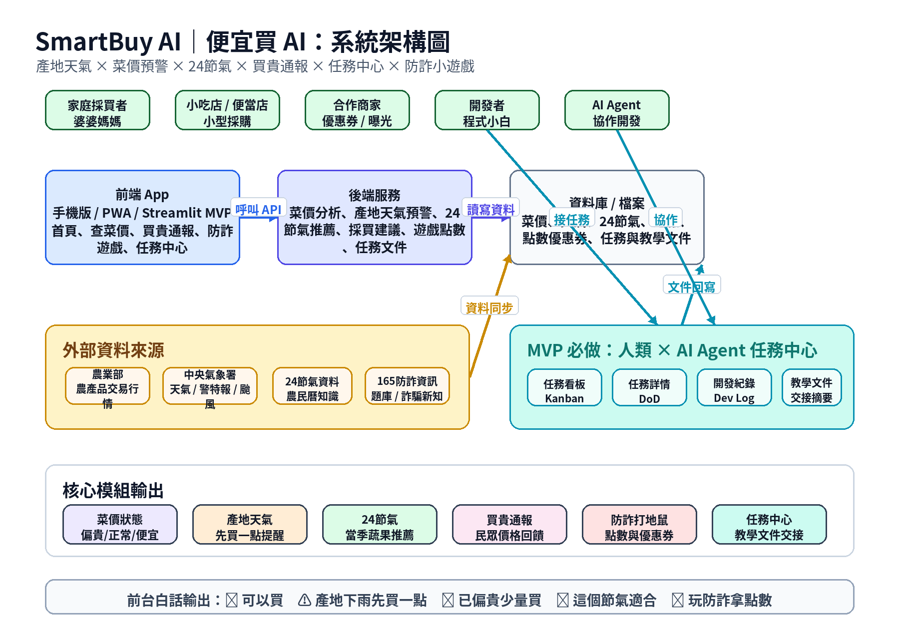

# SmartBuy AI｜便宜買 AI

把農產品行情、24 節氣與下一交易日價格方向分類轉成簡單採買建議的 React + FastAPI MVP。

AI Agent 或開發協作者開始工作前，請先閱讀 `README.md`、`docs/SPEC.md` 與相關任務文件；若未來恢復 `AGENT.md` 或任務中心資料，再依該文件執行。

## 快速開始

```powershell
python -m venv .venv
.\.venv\Scripts\Activate.ps1
pip install -r requirements.txt
pip install -r backend/requirements.txt
python -m uvicorn backend.main:app --reload
```

另開一個終端啟動前端：

```powershell
cd frontend
npm install
npm start
```

執行測試：

```powershell
pytest -q
```

## 資料儲存與雙層架構 (Data Storage Architecture)

為了在免費雲端資源限制下支撐機器學習 (ML) 訓練所需的兩年歷史行情資料，SmartBuy AI 採用**雙層資料儲存架構**：

1. **Supabase PostgreSQL (App 資料庫)**:
   - **定位**: 作為線上 App 即時查詢與每日行情更新之用。
   - **容量與限制**: 由於 Supabase 免費版資料庫容量限制為 500 MB，不適合存放全台數年、每日且涵蓋數千品項與市場的原始交易紀錄。
   - **生命週期**: 線上資料庫預設保留最近 **1 年 (365 天)** 的交易資料（由每日更新腳本自動修剪，保留天數由 `SMARTBUY_PRICE_RETENTION_DAYS` 環境變數控制），以確保輕量化並避免超額。
   - **統一資料存取層 (price_repository.py)**: 線上頁面（如價格搜尋頁）透過 [price_repository.py](file:///d:/AI人工智慧/專題/smartbuy-ai/src/data/price_repository.py) 進行查詢。該資料層實作了「Supabase 優先、本機 CSV 備援」機制：僅在資料庫連線出錯、例外或初始資料集為空時執行 fallback。若資料庫可連線但查詢結果為空（0 筆），則正常顯示「查無資料」，不進行 fallback。回傳的 DataFrame 會統一將 `crop_name` 與 `product_name` 標準化對齊，並在 `df.attrs["source"]` 中附帶實際資料來源標記。

3. **使用者買貴通報 (report_repository.py)**:
   - **定位**: 使用者回報市場實際交易價格的儲存層。
   - **雙層寫入與備援**: 優先寫入 Supabase 的 `price_reports` 資料表（採用參數化防範 SQL 注入），若資料庫連線失敗或離線時，自動安全降級寫入本機 `data/reports/price_reports.csv` 備援，並在前台頁面明確顯示實際資料寫入目標。
   - **無官方行情處理**: 若對應作物查無當日官方行情，相關參考價格與價差欄位寫入 `NULL`，系統與前台防崩潰並允許照常通報。

4. **每日價格方向 ML 預測 (`price_direction_predictions`)**:
   - **定位**: 這是目前正式 MVP 預測流程；使用已訓練好的 LightGBM 價格方向模型，針對每個市場與作物最新有效交易日 `base_date` 產生「下一交易日跌、持平、漲」方向分類。
   - **每日排程**: GitHub Actions `daily_agri_price_update.yml` 在行情更新與 R2 Parquet 同步成功後，執行 `scripts/generate_price_direction_predictions.py`。
   - **資料來源**: 預測腳本呼叫 `load_historical_prices_for_ml()` 讀取 Parquet 資料湖，不大量查詢 Supabase 原始行情表。
   - **寫回表**: 預測結果 upsert 至 Supabase `price_direction_predictions`，欄位包含 `prob_down`、`prob_flat`、`prob_up`、`pred_confidence`、`confidence_level`、`risk_level` 與 `display_message`。
   - **前台展示**: 顯示預測目標「下一交易日」、預測方向、跌/持平/漲三類機率、模型信心程度、資料基準日、資料新鮮度、風險提示與「僅供參考」聲明。
   - **模型檔案**: 預設載入 `models/07_lightgbm_selected_final.joblib`。若更換模型，請維持 payload 內含 `model`、`model_feature_columns`、`categorical_feature_columns` 與 `category_maps`。
   - **建表 SQL**: 初次部署前請先在 Supabase SQL Editor 執行 `scripts/create_price_direction_predictions_table.sql`。

5. **舊版五日數值 Baseline（已退出正式 MVP）**:
   - `prediction_results`、`predicted_price`、`prediction_repository.py` 與 `scripts/generate_baseline_predictions.py` 屬於舊版五日價格回歸 / Baseline 設計。
   - 這些元件不得作為目前前台或每日排程的正式預測路徑，也不得作為查無方向分類結果時的 fallback。

2. **Cloudflare R2 Parquet 歷史資料湖 (ML 數據湖 - Data Lake)**:
   - **定位**: 專為機器學習模型訓練提供的高壓縮比、欄位導向 (Column-oriented) 歷史數據儲存層。
   - **雙向同步與持久化**: 由於 GitHub Actions runner 為暫時機器，歷史資料湖 Parquet 檔案（按月分割，儲存於 `data/history_parquet/`）會雙向同步至 Cloudflare R2 儲存桶。每次行情更新前會自動從 R2 下載既有 Parquet 檔，合併新行情後再上傳更新至 R2 並進行完整性大小驗證。
   - **安全阻斷**: 僅在 Parquet 上傳 R2 成功且驗證通過後，才允許執行 Supabase 90 天前的舊資料 Pruning，確保歷史行情資料安全。
   - **ML 訓練載入方式**: 模型訓練時，應優先讀取 Parquet 數據湖（呼叫 `load_historical_prices_for_ml()` 函式），而不是大量查詢 Supabase 資料庫，避免造成雲端資料庫負擔與限制瓶頸。
   - **預測結果**: 正式 MVP 預測結果寫回 `price_direction_predictions`。舊版 `prediction_results` 不再是正式 MVP 預測資料表。

目前版本使用 `data/` 內的示範資料，可在沒有 API 金鑰的情況下完整展示。正式串接農業部與中央氣象署 API 前，請先確認資料授權、欄位與更新頻率。

完整原始規格請見根目錄的 `SmartBuy_AI_便宜買AI_MVP完整開發規格書_v1.1_含任務中心與24節氣.md`，開發入口見 `docs/SPEC.md`。
