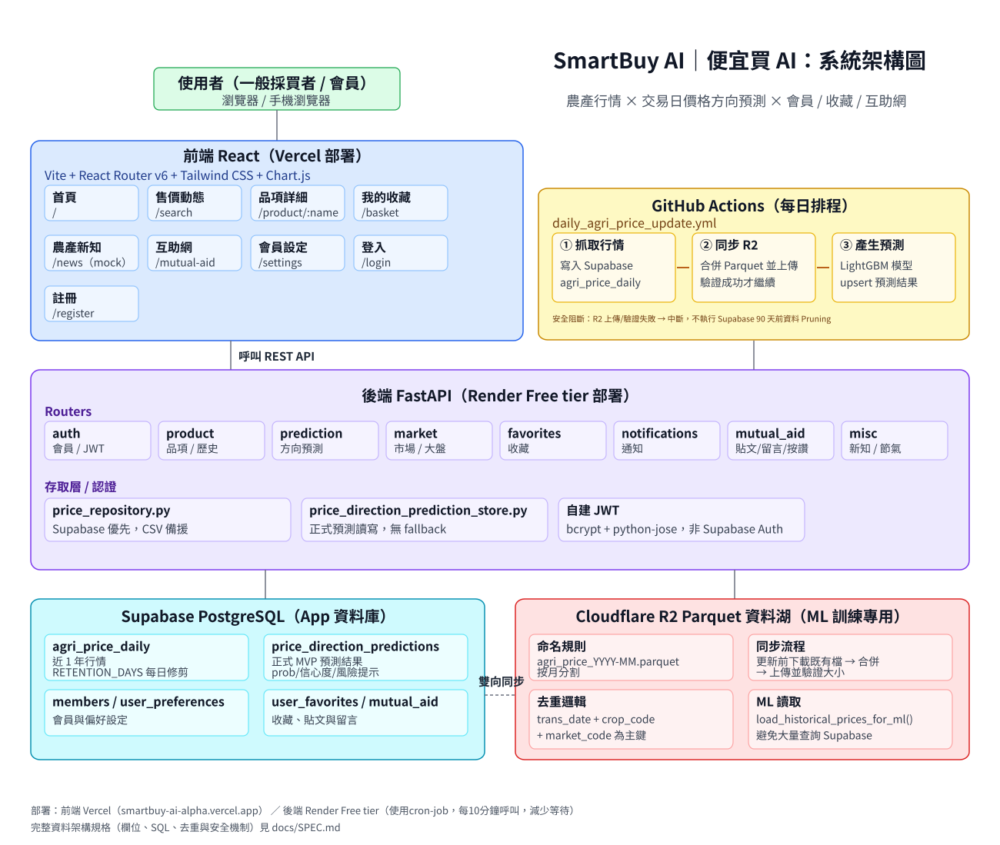

# SmartBuy AI｜便宜買 AI

SmartBuy AI 是一套將農產品行情、天氣、二十四節氣與 AI 價格方向預測，轉換成白話採買建議的智慧買菜助手。

- 🌐 線上體驗：https://smartbuy-ai-alpha.vercel.app/

## 系統定位

SmartBuy AI 希望讓沒有農業或數據背景的使用者，也能快速知道：

- 今天什麼菜比較便宜
- 哪些品項適合現在購買
- 哪些蔬果可能受到天氣影響
- 收藏品項是否降價或可能漲價
- 現在是什麼節氣、適合買什麼

## 主要功能

| 功能 | 說明 |
|---|---|
| 今日採買提醒 | 將行情與預測轉換成簡單的購買建議 |
| 售價動態 | 搜尋農產品，查看近期價格與走勢 |
| 商品詳細資訊 | 查看單一品項行情、價格狀態與下一交易日方向預測 |
| 我的菜籃 | 收藏常買品項，集中追蹤價格變化 |
| 價格與天氣提醒 | 接收降價、漲價、天氣與供應風險提醒 |
| 二十四節氣 | 顯示目前節氣、當季蔬果、採買與料理建議 |
| 農產新知 | 閱讀農產、食材、節氣與市場相關內容 |
| 互助網 | 發布與瀏覽農產急售、求助及資訊分享 |
| 會員設定 | 管理個人資料、通知與顯示偏好 |

## 系統架構

SmartBuy AI 採用前後端分離架構。前端透過 REST API 呼叫 FastAPI 後端，後端再依用途存取即時資料庫、歷史資料湖與 AI 預測結果。

## 技術架構

| 領域 | 技術 |
|---|---|
| 前端 | React 19、Vite、React Router v6、Tailwind CSS、Chart.js、Lucide React |
| 後端 | FastAPI、SQLAlchemy、Pydantic、psycopg2 |
| 資料庫 | Supabase PostgreSQL |
| 歷史資料湖 | Cloudflare R2、Parquet |
| AI 模型 | LightGBM，預測下一交易日「跌／持平／漲」方向 |
| 身分驗證 | JWT、bcrypt、httpOnly Cookie |
| 自動化 | GitHub Actions 每日更新行情與預測結果 |
| 部署 | 前端 Vercel、後端 Render |

## 資料架構

為兼顧線上查詢速度、雲端成本與機器學習訓練需求，系統採用雙層資料儲存：

- **Supabase PostgreSQL**：保存近期行情、會員、收藏、通知、互助網等即時互動資料。
- **Cloudflare R2 Parquet 資料湖**：保存完整歷史行情，供資料分析與 AI 模型訓練使用。
- **GitHub Actions**：每日執行資料更新與價格方向預測，將結果寫回線上資料庫供前台查詢。

## 使用者發展方向

### 初期｜買菜消費者

提供簡單菜價、採買建議、收藏、提醒、節氣與當季推薦。

### 中期｜農民

提供市場行情、產地天氣風險、供應資訊與滯銷互助。

### 後期｜商家

提供採購、庫存、促銷、供需與顧客洞察。

## 系統願景

SmartBuy AI 不只呈現價格數字，而是把複雜資訊整理成每個人都能理解、能立即採取行動的建議，逐步串聯消費者、農民與商家。
